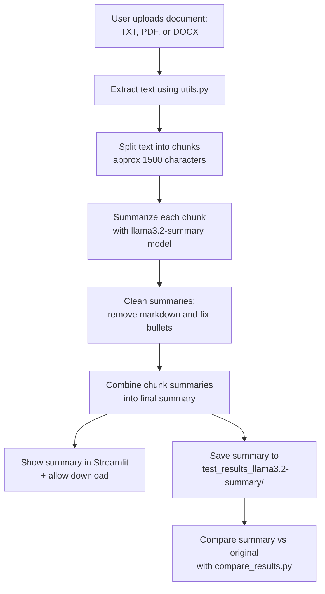
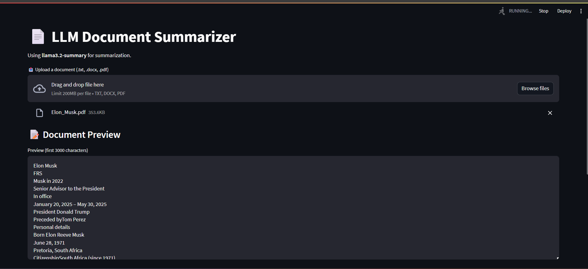
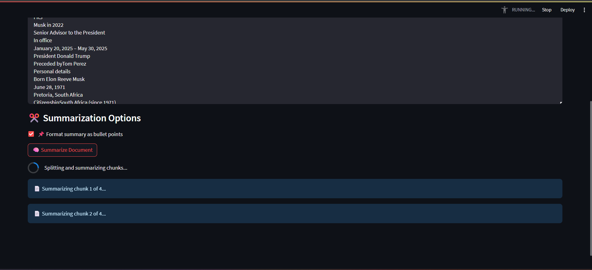
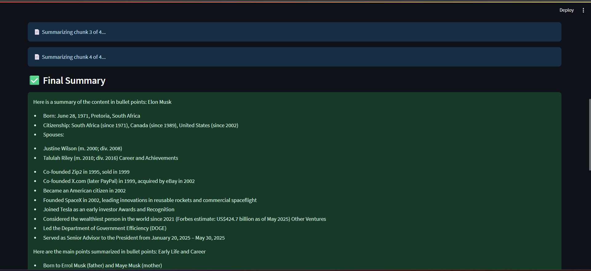
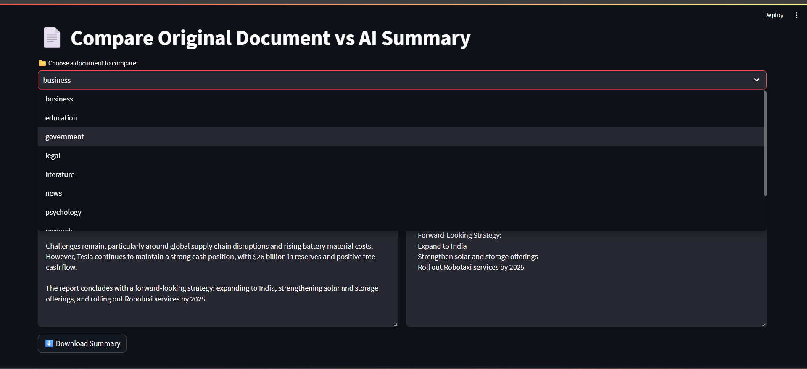
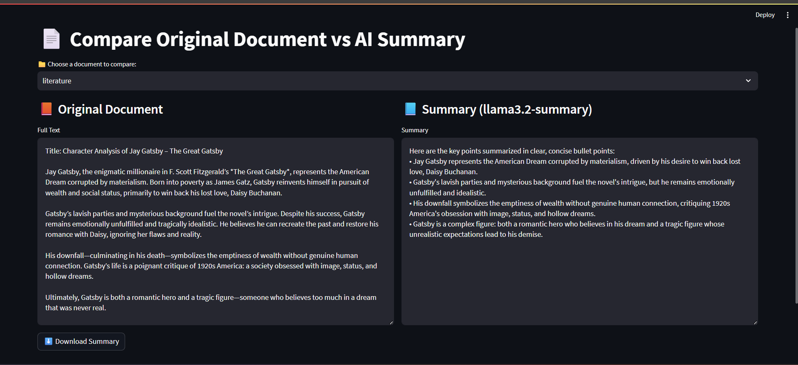

# 📄 LLM-Powered Document Summarizer using Ollama & Streamlit

A local privacy-preserving app that extracts and summarizes documents (`.txt`, `.pdf`, `.docx`) using your own LLM (`llama3.2-summary`) via [Ollama](https://ollama.com/). Built with Python, Streamlit, and a custom fine-tuned model for concise, bullet-point summaries.

---

## Features

- Extracts text from `.txt`, `.pdf`, and `.docx`
- Summarizes large documents in chunks (~1500 characters)
- Outputs clean, bullet-style summaries using `llama3.2-summary`
- Allows summary download as `.txt`
- Batch summarization + comparison view
- 100% local and offline – no OpenAI or cloud dependency

---

## Dependencies

Install via `requirements.txt` or manually:

```bash
pip install streamlit docx2txt pytesseract pdf2image Pillow PyPDF2
```

> Windows users may also need to install poppler for `pdf2image`.

---

## Setup Instructions

### 1. Clone the repo

```bash
git clone https://github.com/your-username/llm-document-summarizer.git
cd llm-document-summarizer
```

### 2. Create a Python environment

```bash
python -m venv venv
source venv/bin/activate  # or .\venv\Scripts\activate on Windows
```

### 3. Install dependencies

```bash
pip install -r requirements.txt
```

### 4. Start Ollama and pull base model

Make sure you’ve installed [Ollama](https://ollama.com/download). Then:

```bash
ollama run llama3.2
```

### 5. Create custom summarizer model

Make a `Modelfile` like this:

```Dockerfile
FROM llama3:2

SYSTEM "You are an expert summarizer. Summarize any input into clear, concise bullet points. Focus only on the most important and relevant information. Eliminate redundancy and preserve the original meaning."

PARAMETER temperature 0.3
```

Then run:

```bash
ollama create llama3.2-summary -f Modelfile
```

---

## Run the App

```bash
streamlit run streamlit_app.py
```

It will launch in your browser.

---

## Folder Structure

```
.
├── streamlit_app.py
├── compare_results.py
├── batch_tests.py
├── utils.py
├── ollama_helper.py
├── test_documents/
├── test_results_llama3.2-summary/
└── llama3.2-summary/
    Modelfile
```

---

## App Flow (Mermaid Diagram)



---

## Screenshots

### File Upload + Summarization

Here we can see pdf file is uploaded and it shows a document preview of first 3000 characters


Here we can see long documents are summarized by chunking with maximum 1500 characters 


Here we can see the final summary of our document


### Comparison View

Here we have documents from various domains like education,government,legal,research,medical,technical etc to compare our summarization app.


Here we can see how the document from literature field is summarized


---

## Sample Prompt to LLM

```
Summarize the following document content in clear, concise bullet points. 
Focus only on the key points while preserving semantic meaning:
```

---

## Why Local?

- No API keys required
- Full privacy — documents stay on your machine
- Custom system prompts for consistent summarization

---

## 📄 License

MIT License — free to use, modify, and build on.

---

## 👩‍💻 Author

Built by **Parvathi Vishnu** — feel free to connect on [LinkedIn](https://www.linkedin.com/) or explore more on [GitHub](https://github.com/your-username).

