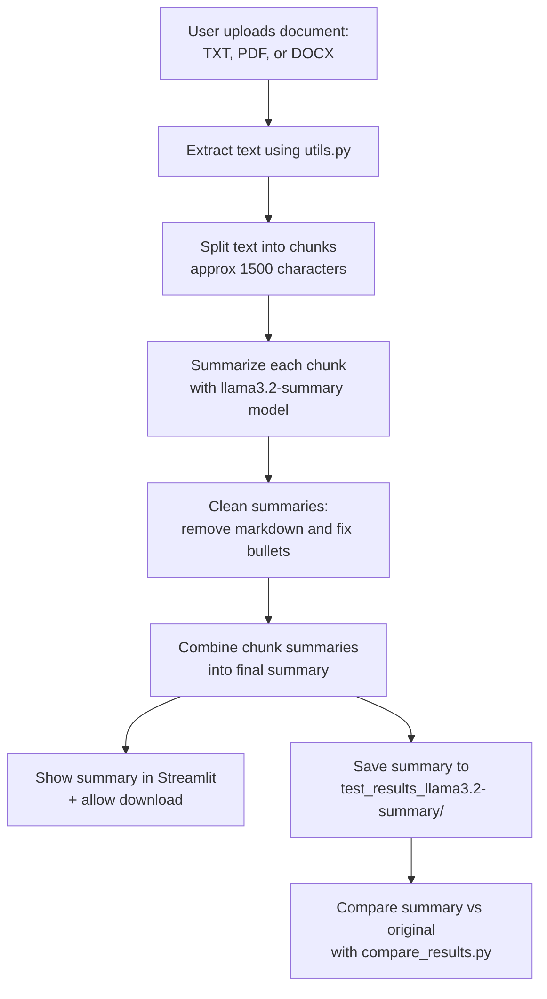

# LLM_Summarizer

```mermaid
flowchart TD
    A[User uploads document:\nTXT, PDF, or DOCX] --> B[Extract text using utils.py]
    B --> C[Split text into chunks\napprox 1500 characters]
    C --> D[Summarize each chunk\nwith llama3.2-summary model]
    D --> E[Clean summaries:\nremove markdown and fix bullets]
    E --> F[Combine chunk summaries\ninto final summary]
    F --> G[Show summary in Streamlit\n+ allow download]
    F --> H[Save summary to\n test_results_llama3.2-summary/]
    H --> I[Compare summary vs original\nwith compare_results.py]
```

